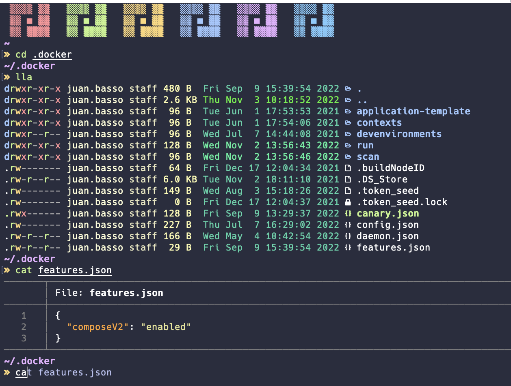

# JC.zsh

JC.zsh is a Zsh configuration that seeks to resemble to Powerlevel10k without the bulkiness of it _(though using Power10k gitstatus)_.



## Disclaimer 
This is a personal zsh configuration so it will have some specific PATHs that you could delete or modify, some examples are the `.zshpath` and the `gcp.plugin.zsh`.

## Getting started
To use this you just need to: 
1. Clone the repository to your `$HOME`.
2. Modify .zshrc on `$HOME` to:
```bash
# Own .zshrc
source ~/.zsh/.zshrc
```

## Preferred Configurations
You can download the terminals profiles from: 
* Mac Terminal: [docs/jc\_zsh.terminal](docs/jc_zsh.terminal)
* Warp Terminal:
```bash
curl -s -N 'https://warp-themes.com/d/fjbIrS03HtcpP5RyQg5z' | bash
```

Here are the full configurations of them to use in any terminal:
* **Font:** [Hack Nerd Font Mono](https://github.com/ryanoasis/nerd-fonts)
* **Terminal Colors:**
  * **Background:**
    * **Color:** 292D3E
    * **Opacity:** 81%
    * **Blur:** 31%
  * **Cursor:**
    * **Color:** 8B8B8B
  * **Text:**
    * **Color:** FFFFFF
  * **Black:**
    * **Normal:** 292D3E
    * **Bright:** 959DCB
  * **Red:**
    * **Normal:** F07178
    * **Bright:** F07178
  * **Green:**
    * **Normal:** C3E88D
    * **Bright:** C3E88D
  * **Yellow:**
    * **Normal:** FFCB6B
    * **Bright:** FF5572
  * **Blue:**
    * **Normal:** 82AAFF
    * **Bright:** 82AAFF
  * **Magenta:**
    * **Normal:** C792EA
    * **Bright:** FFCB6B
  * **Cyan:**
    * **Normal:** 60ADEC
    * **Bright:** 676E95
  * **White:**
    * **Normal:** ABB2BF
    * **Bright:** FFFEFE

## Known Issues
* When there is a crash in the computer and the computer is restarted, the already opened terminals fail to run the `gitstatus` script. This is solved by just doing a `source ~/.zshrc` after the computer is fully booted.
